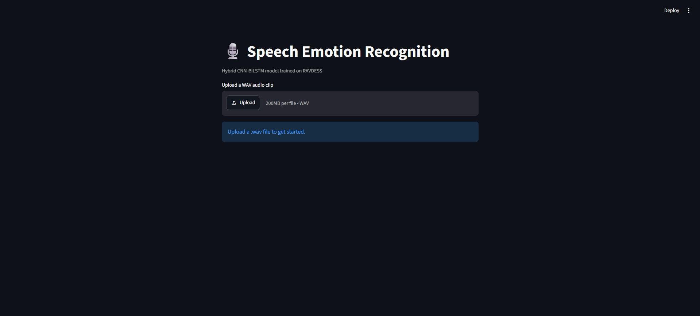
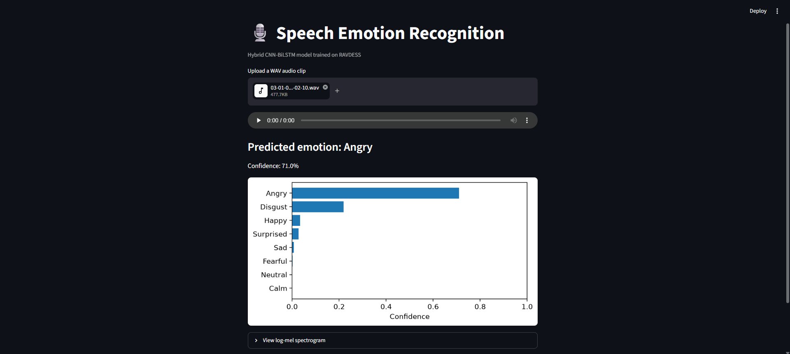
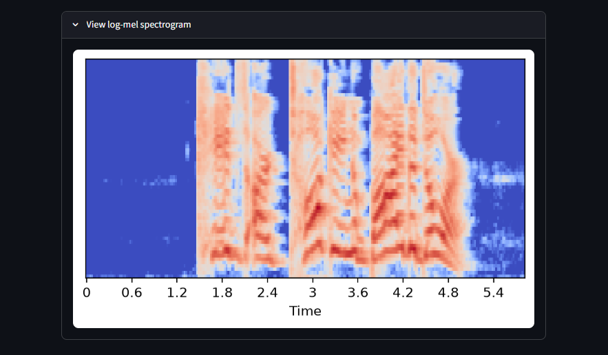

# 🎙️ Speech Emotion Recognition using a Hybrid CNN-BiLSTM Deep Learning Architecture

A deep learning system that classifies human emotion from speech audio, built on the RAVDESS dataset. The project combines a **CNN** branch (log-mel spectrogram features) with a **BiLSTM** branch (MFCC sequence features) in a fused hybrid architecture, and ships with a **Streamlit web UI** for interactive inference.

---

## 📋 Overview

Given a short `.wav` clip of speech, the model predicts one of **8 emotions**:
`neutral`, `calm`, `happy`, `sad`, `angry`, `fearful`, `disgust`, `surprised`

The project covers the full pipeline: dataset preprocessing, feature extraction, model design, training with data augmentation and regularization, evaluation, and deployment as a usable web app.

---

## 🗂️ Project Structure

```
Speech-Emotion-Recognition/
├── Google Colab Code.ipynb   # Full training pipeline (data → features → models → evaluation)
├── app.py                     # Streamlit UI for local inference
├── requirements.txt           # Python dependencies for the app
├── model/
│   ├── hybrid_cnn_bilstm_final_v2.keras   # Trained hybrid model
│   ├── label_map.json                     # Index → emotion name mapping
│   └── feature_config.json                # Feature extraction settings (must match training)
├── .gitignore
└── README.md
```

---

## 📊 Dataset

**RAVDESS** — Ryerson Audio-Visual Database of Emotional Speech and Song (speech-only subset)
- 1,440 audio files · 24 professional actors (12 male, 12 female)
- 8 emotions, 2 intensity levels, 2 lexically-matched statements
- [Dataset link (Kaggle)](https://www.kaggle.com/datasets/uwrfkaggler/ravdess-emotional-speech-audio)
- License: CC BY-NC-SA 4.0 — **not included in this repo**; download it separately if you want to re-run the notebook

Each filename encodes 7 attributes (e.g. `03-01-06-01-02-01-12.wav`), which the notebook parses directly to build labels — no separate label file needed.

---

## 🧠 Model Architecture

Two models were built and compared:

| Model | Input | Description |
|---|---|---|
| **CNN Baseline** | Log-mel spectrogram | 3 Conv2D blocks (BatchNorm + ReLU + MaxPool + Dropout) → GlobalAveragePooling → Dense → Softmax |
| **Hybrid CNN-BiLSTM** | Log-mel spectrogram + MFCC sequence | CNN branch (spatial/frequency patterns) + BiLSTM branch (temporal dynamics) → feature fusion (concatenate) → Dense → Softmax |

**Feature extraction:**
- Log-Mel Spectrogram: 64 mel bands, FFT size 1024, hop length 256
- MFCC: 40 coefficients, kept as a time sequence

**Preprocessing:** mono → resampled to 16 kHz → amplitude-normalized → fixed to 4 seconds (padded/trimmed)

**Data split:** speaker-independent — 16 actors for training, 4 for validation, 4 for test, with no actor appearing in more than one split (gender-balanced).

**Anti-overfitting measures (v2):**
- Offline data augmentation on the training set: pitch shift, time-stretch, and noise injection (4x training data)
- SpecAugment-style random frequency/time masking on augmented spectrograms
- L2 weight regularization, increased dropout, and a smaller parameter count than the initial design

---

## 📈 Results

Evaluated on the held-out, speaker-independent test set (4 unseen actors, 240 clips):

| Model | Accuracy | Precision | Recall | F1-score |
|---|---|---|---|---|
| CNN Baseline (v2) | 43.75% | 37.69% | 44.53% | 35.82% |
| **Hybrid CNN-BiLSTM (v2)** | 41.67% | 36.11% | 42.97% | **37.63%** |

The hybrid model achieves a better macro F1-score than the CNN-only baseline, indicating more balanced performance across emotion classes despite a marginally lower raw accuracy. Both models perform strongly on `surprised`, `calm`, and `angry`, but struggle to separate `happy` from other classes — a known difficulty on RAVDESS given how acoustically similar some acted emotions are.

Full training curves, per-class precision/recall/F1, and confusion matrices are available in the notebook.

---

## 🖼️ Demo

The Streamlit UI in action — upload a `.wav` clip and get an instant emotion prediction with a confidence breakdown and spectrogram view.

| Upload screen | Prediction + confidence chart | Log-mel spectrogram |
|---|---|---|
|  |  |  |

---

## 🚀 Getting Started

### Option 1: Run the training pipeline (Google Colab)

1. Open `Google Colab Code.ipynb` in [Google Colab](https://colab.research.google.com)
2. Set runtime to GPU (Runtime → Change runtime type → T4 GPU)
3. Run all cells — the notebook downloads RAVDESS (via `kagglehub` or your own Google Drive copy), preprocesses audio, extracts features, trains both models, and evaluates them
4. Trained model artifacts are saved and ready to copy into `model/` for the app

### Option 2: Run the Streamlit UI locally

```bash
# Clone the repo
git clone https://github.com/NikhilAnkola/Speech-Emotion-Recognition.git
cd Speech-Emotion-Recognition

# Create and activate a virtual environment
python -m venv venv
venv\Scripts\activate        # Windows
source venv/bin/activate     # macOS/Linux

# Install dependencies
pip install -r requirements.txt

# Run the app
streamlit run app.py
```

Open the local URL Streamlit prints (usually `http://localhost:8501`), upload a `.wav` file, and view the predicted emotion with a confidence breakdown and log-mel spectrogram visualization.

---

## 🛠️ Tech Stack

- **Modeling:** TensorFlow / Keras
- **Audio processing:** librosa
- **Training environment:** Google Colab (T4 GPU)
- **UI:** Streamlit
- **Data handling:** NumPy, pandas
- **Evaluation/visualization:** scikit-learn, matplotlib, seaborn

---

## ⚠️ Limitations

- RAVDESS consists of **acted, scripted** emotion from professional actors — not spontaneous, real-world speech. Performance on natural conversational audio is likely lower.
- Speaker-independent evaluation, while more realistic than a random split, is also harder — results here should be read in that context rather than compared directly to papers using random splits.
- `happy` remains the most difficult class to separate from neighboring emotions in both models.

## 🔭 Future Scope

- Transfer learning with pretrained audio embeddings (wav2vec 2.0, YAMNet) for stronger feature representations
- Training on spontaneous, real-world speech datasets for production readiness
- Multilingual / cross-cultural emotion recognition
- Live microphone input in the UI, in addition to file upload
- Multimodal extension combining audio with facial expression or text sentiment

---

## 🙏 Acknowledgments

- RAVDESS dataset: Livingstone & Russo, *PLoS ONE* — [paper link](https://doi.org/10.1371/journal.pone.0196391)
- Built as a Foundations of Deep Learning microproject

## 📄 License

This project's code is available for educational and academic use. The RAVDESS dataset is licensed separately under CC BY-NC-SA 4.0 and is not redistributed in this repository.
